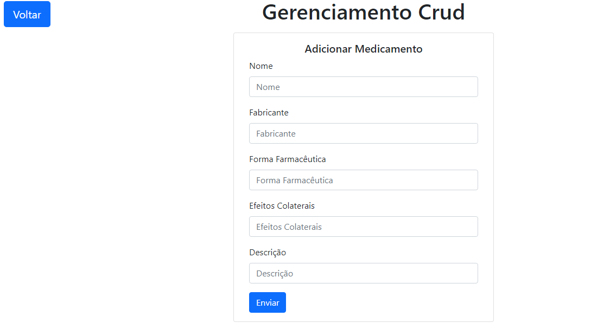
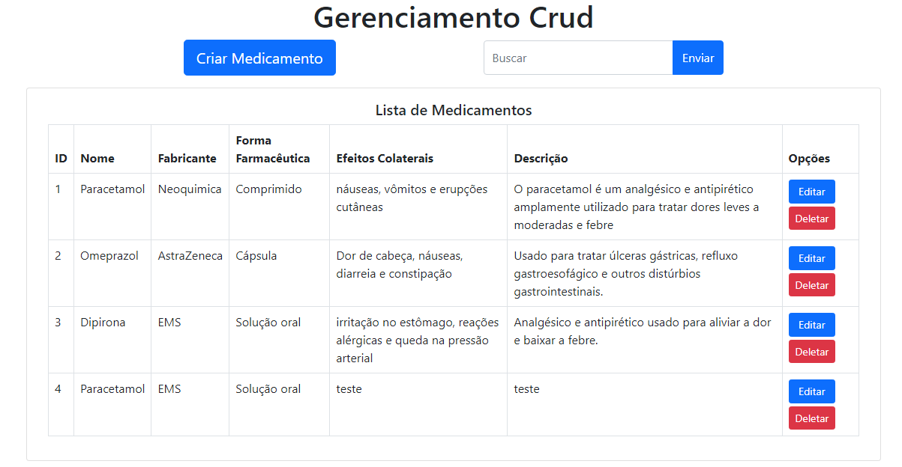
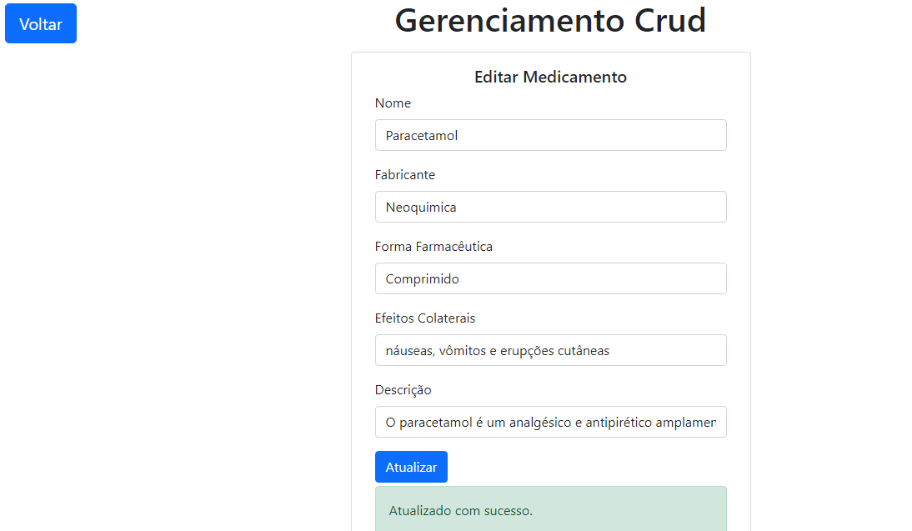

# CRUD em Code Igniter 3 - PHP

;
;
;

# Sobre o projeto 
É um projeto focado no aprendizado do framework Code Igniter 3, e Modelo MVC em POO, aplicando CRUD.
É um CRUD de Medicamentos, tendo dados como: nome, fabricante, forma farmacêutica, efeitos colaterais,descrição...

## Tecnologias utilizadas
PHP, MySQL, CodeIgniter 3, HTML, CSS, XAMPP.

No pacote XAMPP, foi utilizado o servidor web Apache e o sistema de gerenciamento de banco de dados MySQL.

## Principais arquivos:

### Pasta Model
- Medicamento_model.php: Parte responsável pela manipulação dos dados no Banco de Dados. Contém funções como insertMedicamento, getMedicamentos, deleteMedicamento, etc; 

### Pasta Controller
- Medicamento.php: Responsável em receber e enviar dados do Model/View e carregar as views. Contém funções como add, edit, delete, etc;

### Pasta View
- add_medicamento.php: Responsável pela interface para criação de um Medicamento.
- edit_medicamento.php: Responsável pela edição de algum medicamento específico.
- index.php: Onde há a lista de medicamentos, o campo de Buscar medicamento, opções como editar ou deletar medicamento.
